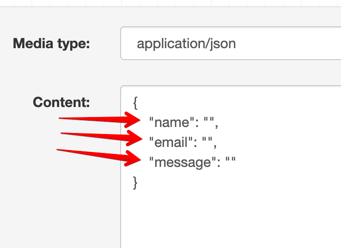
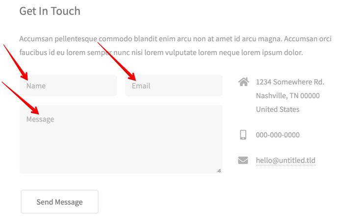

## FullStack Developer Test Task

- Fork current repository to your GitHub account 
- Add handler to the contact form (index.html) and send form data with the following format: 
```
POST https://api.byteplex.info/api/test/contact/
```



- Register any free domain name
- Deploy current project to any free static website hosting
- Attach previously registered domain to the deployed project 

### Task result:

- Link to the updated source code repository
- Link to the deployed website

### Notes:
All subtasks are optional. If you do not have enough time to do any of the tasks, you can skip it. 
Provide in the end only what you managed to do.